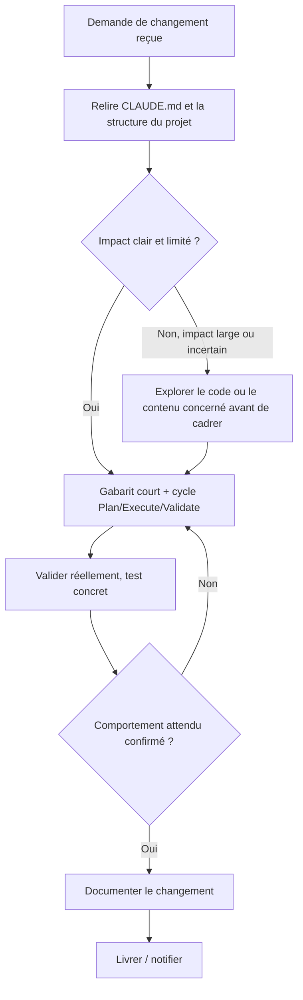
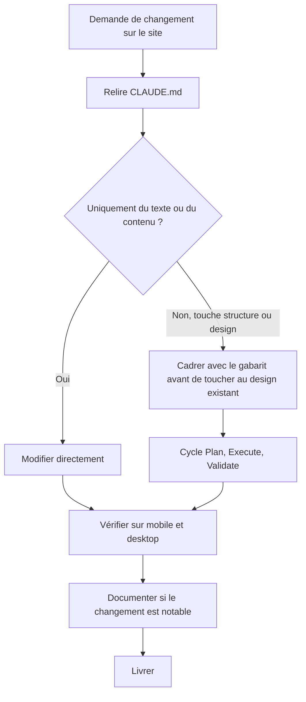
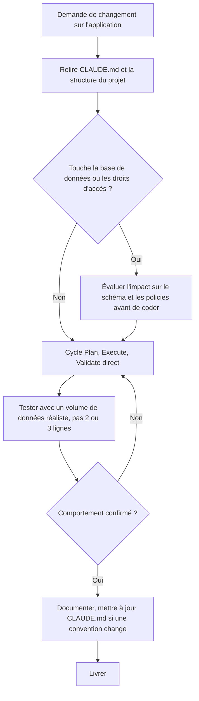
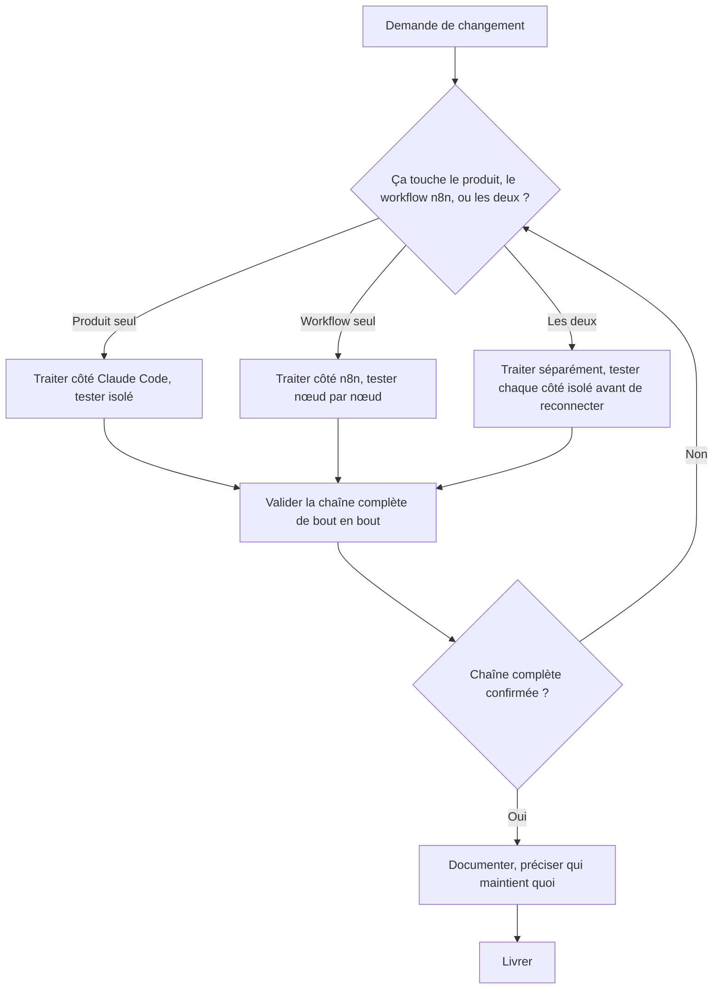
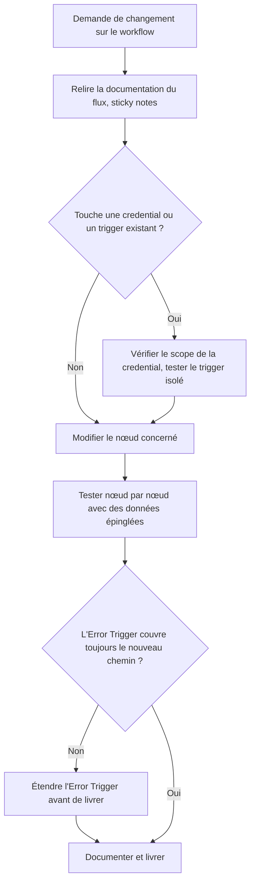
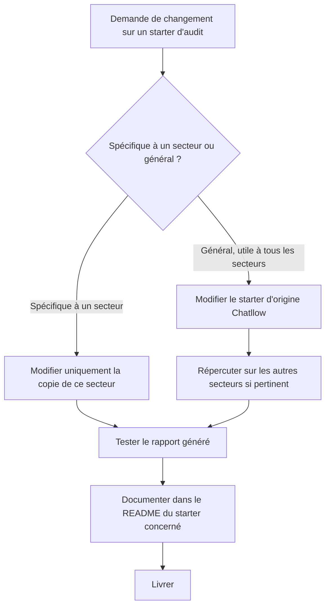
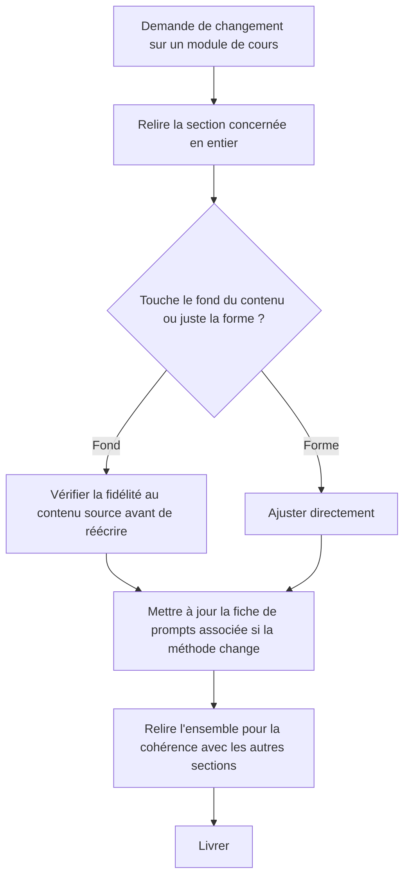
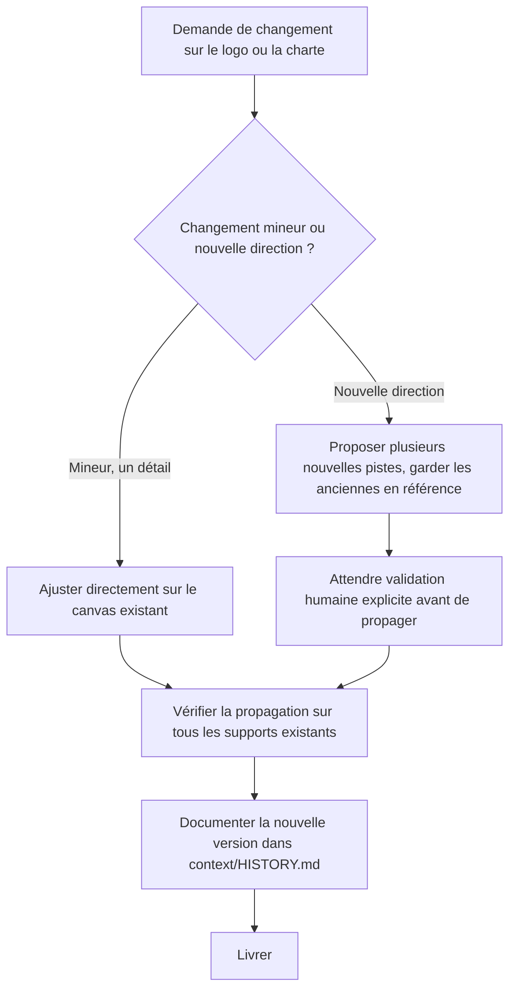

# Maintenance d'un système, par type de projet

> Compagnon de `methode-approche-projet.md`. Comment maintenir un système déjà construit, pas comment le construire la première fois. Basé sur le Module 1, section 6, chapitre 2 ("Maintenir et faire évoluer un projet dans le temps") : comprendre rapidement un projet existant, évaluer l'impact réel d'un changement avant de l'implémenter, garder une trace claire de chaque évolution.

## Le flux générique

Chaque type de projet ajoute une vérification spécifique à ce flux générique, là où le risque réel se situe pour ce type précis.

---

## Site vitrine / landing page

**Exemple concret.** Le client (menuiserie) demande d'ajouter une section "Avis clients" sur sa page d'accueil. Ce n'est pas juste du texte, ça touche la structure de la page. On suit donc la branche de droite : on cadre avec le gabarit (contexte, objectif, périmètre, autonomie) avant de toucher au design déjà en place, on construit avec Plan/Execute/Validate, puis on vérifie que la nouvelle section s'affiche bien sur mobile et sur ordinateur avant de livrer. Si le client avait juste demandé de changer un numéro de téléphone dans le texte, on aurait pris la branche de gauche : modification directe, vérification rapide, sans tout le cadrage.

## Application / SaaS (type Kora)

**Exemple concret.** BONJOUR demande d'ajouter un champ "budget estimé" sur la fiche prospect de Kora. Ça touche la base de données (une nouvelle colonne) et potentiellement les droits d'accès (qui peut voir ce champ dans la hiérarchie). On évalue d'abord l'impact sur le schéma Supabase et les policies RLS avant d'écrire une ligne de code, puis on construit, puis on teste avec une vraie volumétrie (pas juste les 2-3 prospects de test habituels) pour vérifier que rien ne ralentit ou ne casse avec plus de données. On documente dans CLAUDE.md si ça change une convention (par exemple, si tous les nouveaux champs doivent maintenant suivre un certain format).

## Fullstack (Claude Code + n8n)

**Exemple concret.** Sur le scénario Alpha Conseil (Module 1, section 5), on demande d'envoyer une notification email dès qu'un prospect passe au statut "Signé". Ça touche les deux côtés : le produit (le champ statut, déjà dans l'interface Claude Code) et n8n (le workflow qui détecte ce changement et envoie l'email). On traite les deux séparément, on teste le changement de statut seul dans l'interface, on teste l'envoi d'email seul en déclenchant le workflow n8n à la main, puis on connecte les deux et on valide la chaîne complète : changer réellement un statut dans l'interface et vérifier que l'email arrive bien. On documente qui s'occupe de quoi si ça casse un jour (le produit ou le workflow).

## Automatisation n8n seule

**Exemple concret.** Le workflow de qualification commerciale (Module 2, section 2) doit maintenant notifier un nouveau canal Slack plutôt que l'ancien. Ça touche une credential (l'accès Slack) et potentiellement le trigger si le canal détermine aussi quand le workflow se déclenche. On vérifie le scope de la nouvelle credential Slack (accès juste à ce canal, pas à tout l'espace de travail), on teste le nœud Slack isolé avec le nouveau canal, puis on vérifie que l'Error Trigger existant couvre toujours ce nouveau chemin (si l'envoi Slack échoue, est-ce qu'on est encore prévenu ?) avant de documenter et livrer.

## Audit / conseil IA (starter Chatllow)

**Exemple concret.** Tu veux ajouter un champ "budget IA estimé" au rapport généré. C'est utile pour les 6 secteurs (Chatllow, immobilier, hôtellerie, BTP, finance, industrie), pas juste un seul : c'est donc général. On modifie le starter d'origine Chatllow, on teste que le rapport se génère toujours correctement, puis on répercute le même changement sur les 5 autres secteurs, chacun avec son vocabulaire adapté. On documente dans chaque README concerné que ce champ a été ajouté.

## Formation / contenu pédagogique (Vivier IA)

**Exemple concret.** Tu remarques une erreur dans l'exemple Alpha Conseil de la section 5 du Module 1 (un chiffre qui ne correspond plus à ce qui est dit ailleurs). C'est une question de fond, pas juste une faute de frappe. On relit toute la section pour vérifier que la correction reste fidèle au contenu source, on corrige, et on vérifie si la fiche de prompts associée (05-fullstack-fil-rouge-prompts.md) référence ce même exemple et doit être ajustée en cohérence. On relit l'ensemble avant de livrer, pour ne pas corriger un détail en créant une incohérence ailleurs.

## Branding / identité visuelle

**Exemple concret.** Tu veux essayer un corail un peu plus foncé sur le logo Vivier IA. C'est un changement mineur, un détail de teinte, pas une nouvelle direction. On ajuste directement sur le canvas Claude Design existant (la pastille de couleur déjà interactive le permet). Mais avant de considérer ça terminé, on vérifie la propagation : le logo est déjà utilisé sur le support de présentation du Module 1 (9 slides), donc ce changement de teinte doit aussi être répercuté là-bas, pas seulement sur le fichier du logo isolé. On documente la nouvelle teinte dans `context/HISTORY.md` une fois tout propagé.

---

## Ce qui ne change jamais entre les types

- Relire le contexte existant avant d'agir, jamais supposer la structure ou les décisions passées
- Une validation réelle avant de considérer le changement terminé, pas une supposition
- Documenter, même brièvement, pour que le prochain changement (par soi-même ou quelqu'un d'autre) reparte d'une base claire
