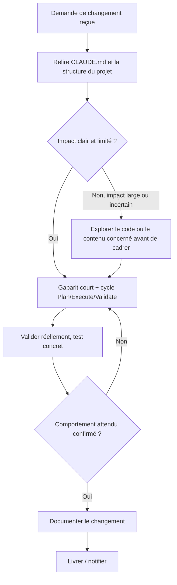
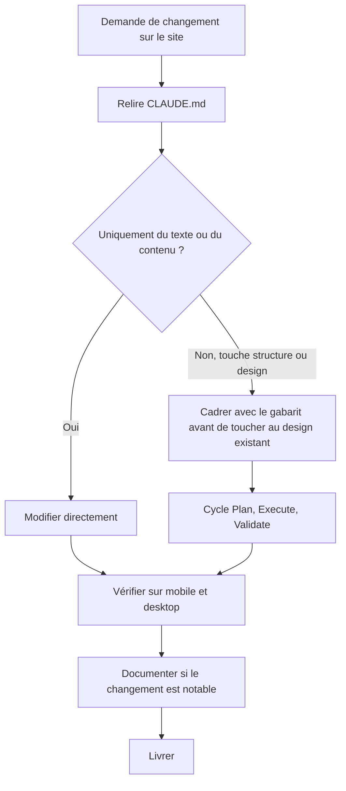
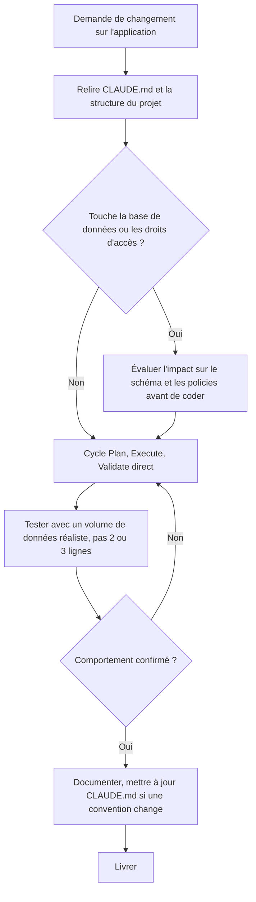
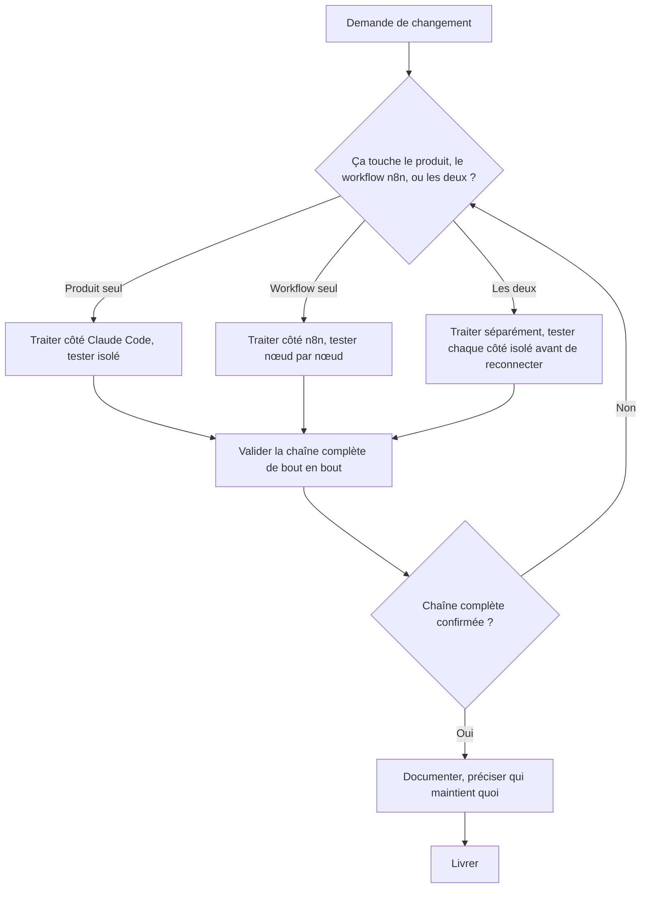
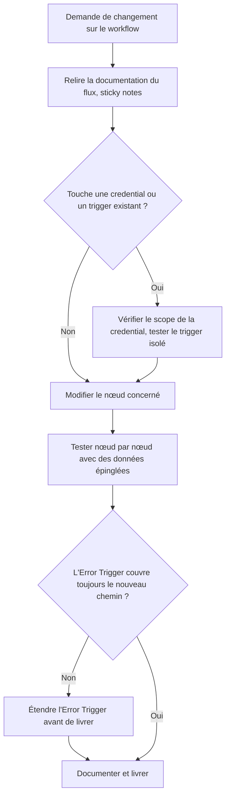
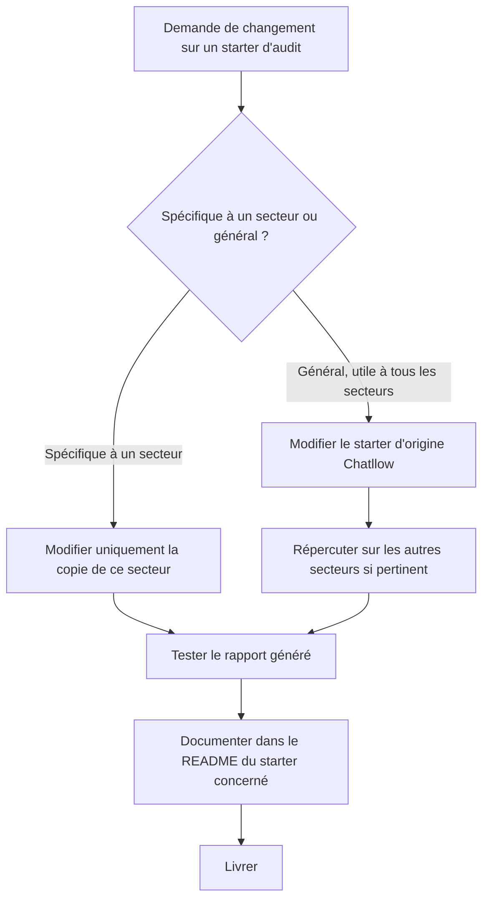
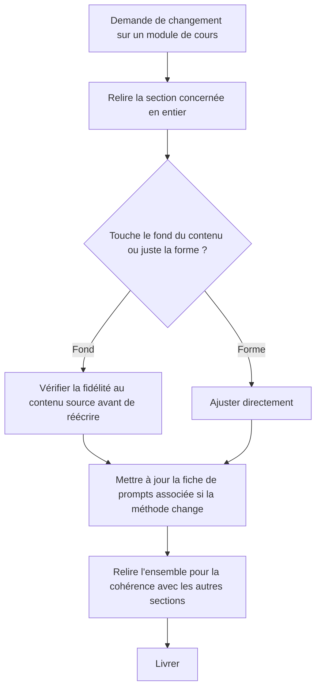
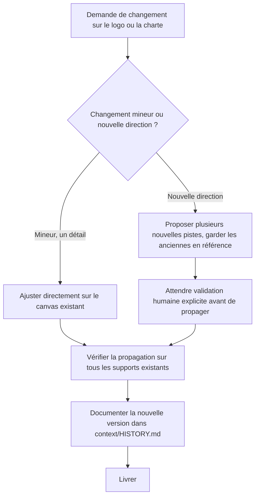

# Maintenance d'un système, par type de projet

> Compagnon de `methode-approche-projet.md`. Comment maintenir un système déjà construit, pas comment le construire la première fois. Basé sur le Module 1, section 6, chapitre 2 ("Maintenir et faire évoluer un projet dans le temps") : comprendre rapidement un projet existant, évaluer l'impact réel d'un changement avant de l'implémenter, garder une trace claire de chaque évolution.

## Le flux générique

Chaque type de projet ajoute une vérification spécifique à ce flux générique, là où le risque réel se situe pour ce type précis.

---

## Site vitrine / landing page

## Application / SaaS (type Kora)

## Fullstack (Claude Code + n8n)

## Automatisation n8n seule

## Audit / conseil IA (starter Chatllow)

## Formation / contenu pédagogique (Vivier IA)

## Branding / identité visuelle

---

## Ce qui ne change jamais entre les types

- Relire le contexte existant avant d'agir, jamais supposer la structure ou les décisions passées
- Une validation réelle avant de considérer le changement terminé, pas une supposition
- Documenter, même brièvement, pour que le prochain changement (par soi-même ou quelqu'un d'autre) reparte d'une base claire
